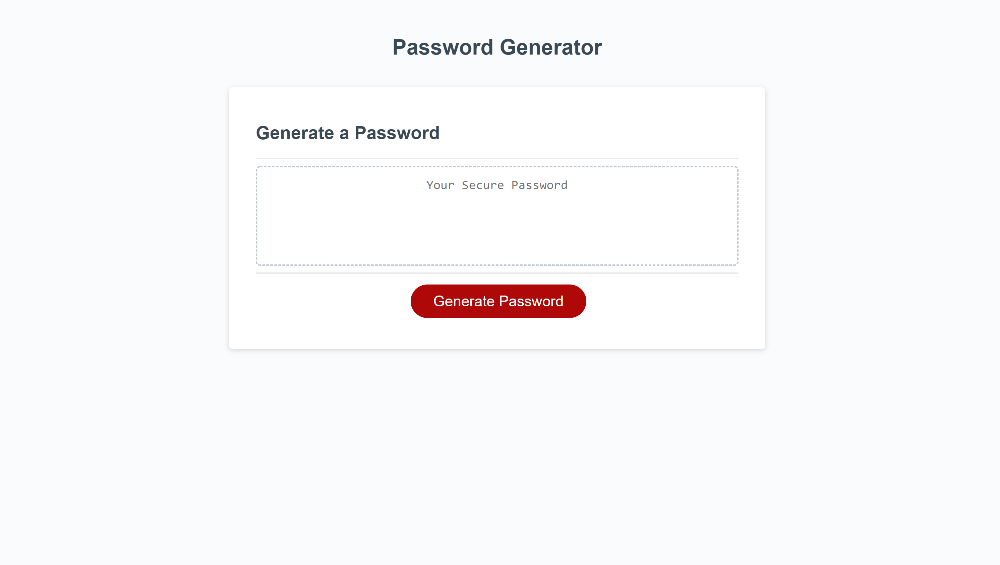

# PasswordGenerator

I have created an application that generates a random password based on user-selected criteria.

The application prompts the user to enter how long they would like the password to be.
If the user does not enter between 8 and 128 characters, the user is alerted to choose between 8 and 128 characters.

The user is then asked to confirm whether they would like lowercase, uppercase, numbers and special characters included in the password.
If the user does not chose any criteria they are alerted to select criteria for the password.

If, else if, else statements are used to generate a password with only the criteria selected by the user.

A for loop is used to generate a random combination for the password using the choices (criteria) selected by the user.

An array is used for defining lowercase, uppercase, numbers, and special characters.
A writePassword function is used to write the password generated into the textbox.
An event listener is added to the generate button to listen for "click".

## Deployed Application

https://erikabeasley.github.io/PasswordGenerator/

